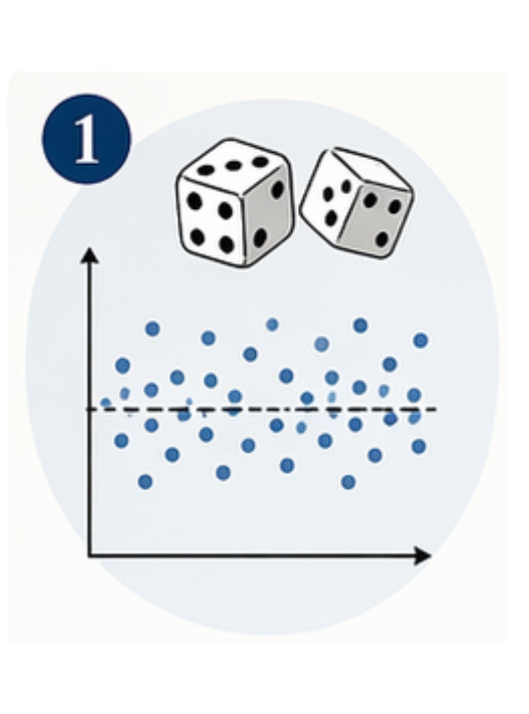
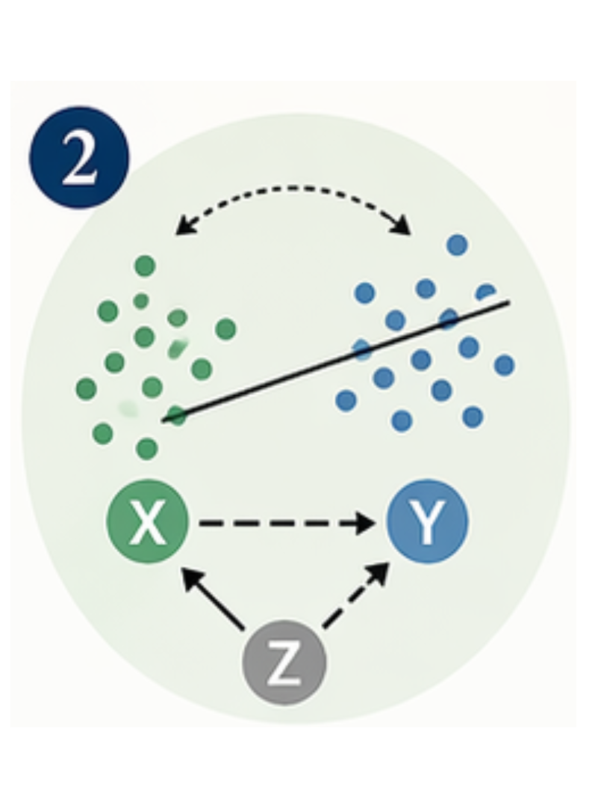
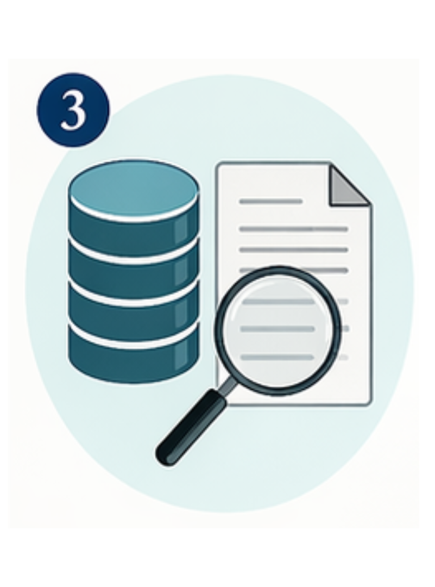
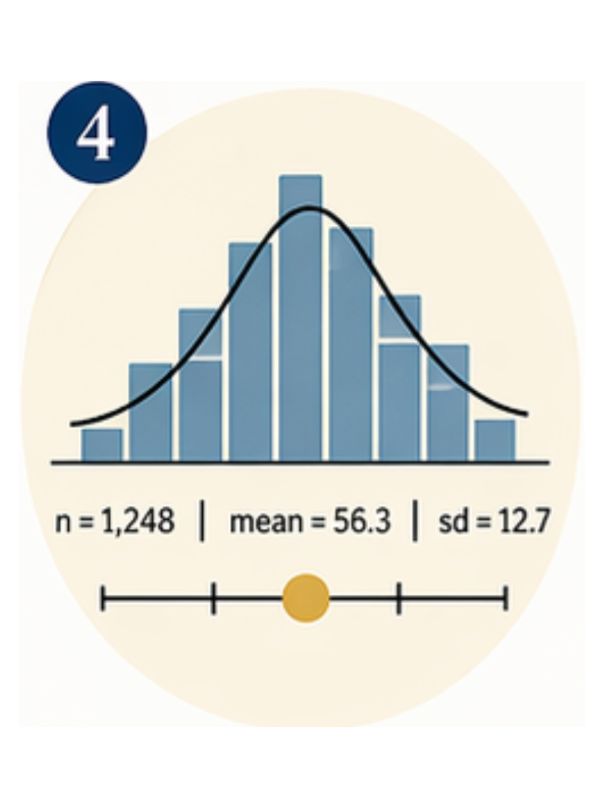
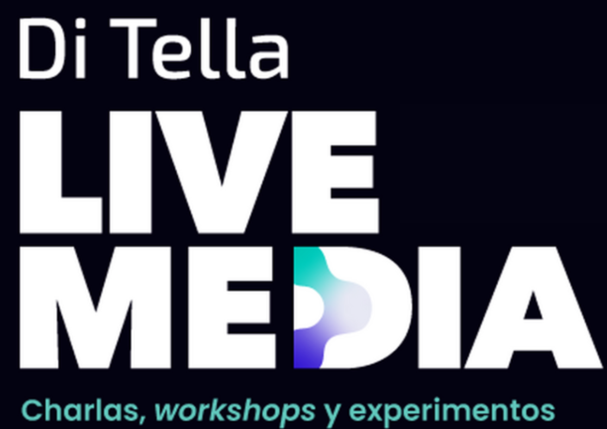

::: {.content-visible when-profile="en"}

In recent years I have designed and taught courses and workshops for journalists and media professionals who work with data. The need is not new — journalism educators have argued for over a century that quantitative literacy should be a core part of journalism training. It rarely is.

Through real examples from the media and interactive exercises, these workshops develop a critical eye toward statistics and offer practical tools for communicating quantitative information honestly and effectively. Four central ideas run through every session: chance as a legitimate explanation for patterns in data; the difference between correlation and causation; the quality and origin of data before turning them into stories; and statistics as summaries — useful or useless depending on what they are built to measure.

**What these workshops cover**

1

Chance as an explanation

Our brains are pattern-finding machines. A key question is: what would we expect if this were just luck?

2

Correlation vs. causation

Two things moving together doesn't mean one causes the other. How to spot the difference and use the right language.

3

Data quality

Where do the numbers come from? Who collected them, how, and for what purpose? The origin of data is the first thing to check.

4

Statistics as summaries

Every statistic is a compression of reality. The question is whether that compression is useful for the story you're telling.

### Courses & workshops {#courses-en}

<a href="https://www.utdt.edu/ver_evento_agenda.php?id_evento_agenda=12735&id_item_menu=440">Del dato a la nota</a>

UTDT Live Media · Universidad Torcuato Di Tella

Workshop · August 2025

<a href="https://sites.google.com/view/cursoperiodismodatos/curso">Periodismo y Datos 2024</a>

UBA · Specialization in Science & Technology Communication

4 sessions · June 2024

<a href="https://sites.google.com/view/curso-periodismo-y-datos-2023/curso">Periodismo y Datos 2023</a>

UBA · Instituto de Cálculo · with Walter Sosa Escudero

2 sessions · October 2023

<a href="https://sites.google.com/view/cursoperiodismoydatos2022">Periodismo y Datos 2022</a>

UBA · Exactas · free with certificate

4 sessions · Oct–Nov 2022

:::

::: {.content-visible when-profile="es"}

En los últimos años diseñé y dicté cursos y talleres para periodistas y trabajadores de medios que tienen que trabajar con datos. La necesidad no es nueva — hace más de cien años que los formadores de periodistas argumentan que el razonamiento cuantitativo debería ser parte central de la formación periodística. Rara vez lo es.

A partir de ejemplos reales de los medios de comunicación y ejercicios interactivos, estos talleres entrenan la mirada crítica frente a la estadística y ofrecen herramientas prácticas para comunicar información cuantitativa de manera honesta y efectiva. Cuatro ideas atraviesan cada encuentro: el azar como explicación legítima de los patrones que vemos en los datos; la diferencia entre correlación y causalidad; la calidad y el origen de los datos antes de convertirlos en historia; y la estadística como resumen — útil o inútil según para qué fue construida.

**Qué se trabaja en estos talleres**

1

El azar como explicación

Nuestro cerebro es una máquina de detectar patrones. La pregunta clave: ¿qué esperaríamos si esto fuera sólo suerte?

2

Correlación y causalidad

Que dos cosas vayan juntas no significa que una cause la otra. Cómo distinguirlas y elegir el lenguaje correcto.

3

Calidad de los datos

¿De dónde vienen los números? ¿Quién los recolectó, cómo y para qué? El origen de un dato es lo primero que hay que revisar.

4

La estadística como resumen

Todo indicador estadístico es una compresión de la realidad. La pregunta es si esa compresión es útil para la historia que querés contar.

### Cursos y talleres {#courses-es}

<a href="https://www.utdt.edu/ver_evento_agenda.php?id_evento_agenda=12735&id_item_menu=440">Del dato a la nota</a>

UTDT Live Media · Universidad Torcuato Di Tella

Taller · agosto 2025

<a href="https://sites.google.com/view/cursoperiodismodatos/curso">Periodismo y Datos 2024</a>

UBA · Especialización en Comunicación Científica y Tecnológica

4 clases · junio 2024

<a href="https://sites.google.com/view/curso-periodismo-y-datos-2023/curso">Periodismo y Datos 2023</a>

UBA · Instituto de Cálculo · con Walter Sosa Escudero

2 clases · octubre 2023

<a href="https://sites.google.com/view/cursoperiodismoydatos2022">Periodismo y Datos 2022</a>

UBA · Exactas · gratuito con certificado

4 clases · oct–nov 2022

:::
